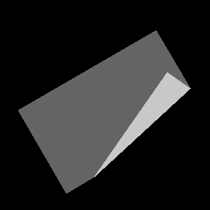

# gymnasium-alma/fake_folding

Runs with labeled data generated via <https://github.com/roboticslab-uc3m/alma-dataset>. You can also directly run with the publicly available dataset <https://doi.org/10.5281/zenodo.14864392>.



## Installation

```bash
pip install -e .
```
